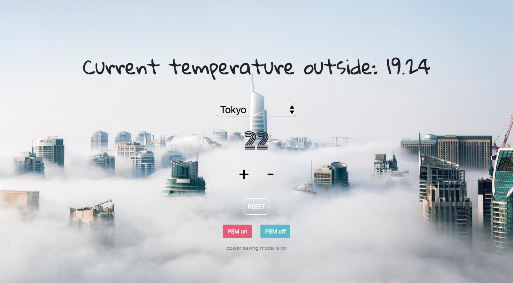

# The Thermostat App

## Setting up the foundations
This is a TDD javascript app that simulates a thermostat.

## Specification

Thermostat starts at 20 degrees 
You can increase the temperature with an up function 
You can decrease the temperature with a down function 
The minimum temperature is 10 degrees 
If power saving mode is on, the maximum temperature is 25 degrees 
If power saving mode is off, the maximum temperature is 32 degrees 
Power saving mode is on by default 
You can reset the temperature to 20 with a reset function 
You can ask about the thermostat's current energy usage: < 18 is low-usage, < 25 is medium-usage, anything else is high-usage. 

## Implementing the requirements
I used a weather API to get the current temperature in a city selected by the user.

## Final product

